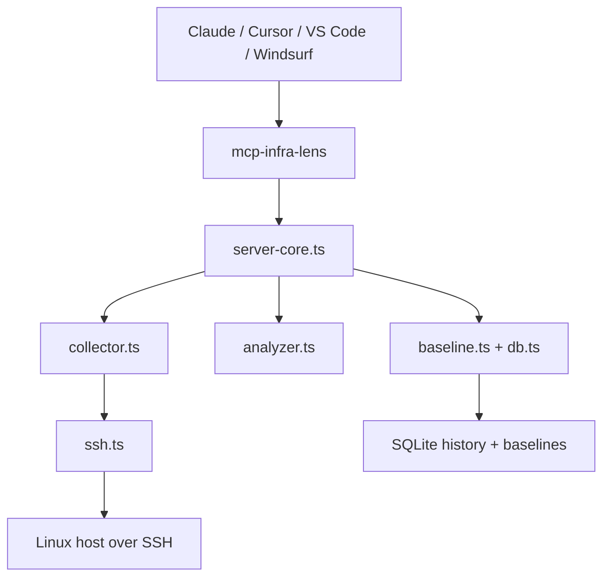

# mcp-infra-lens

Explain Linux incidents over SSH with baseline-aware MCP tooling.

[](https://www.npmjs.com/package/mcp-infra-lens)
[](https://github.com/oaslananka-lab/mcp-infra-lens/actions/workflows/ci.yml)
[](https://github.com/oaslananka-lab/mcp-infra-lens/actions/workflows/security.yml)
[](https://github.com/oaslananka-lab/mcp-infra-lens/actions/workflows/codeql.yml)
[](https://scorecard.dev/viewer/?uri=github.com/oaslananka-lab/mcp-infra-lens)
[](https://github.com/oaslananka-lab/mcp-infra-lens/actions/workflows/release.yml)
[](https://www.npmjs.com/package/mcp-infra-lens)
[](./LICENSE)
[](https://nodejs.org/)
[](https://www.npmjs.com/package/@modelcontextprotocol/sdk)
[](https://dev.azure.com/oaslananka/open-source/_build?definitionId=61)

## Demo


Sample `analyze_server` response when Claude asks, "What's wrong with prod-01?":

```json
{
  "host": "prod-01.internal",
  "health_score": 42,
  "summary": "Found 2 anomalies on prod-01.internal. Most urgent signal: CPU is at 91% (3.4σ above baseline 28.2%). Load is 7.2/6.8/5.1. Top CPU consumer: java (87%).",
  "anomalies": [
    {
      "metric": "cpu",
      "severity": "high",
      "value": 91,
      "z_score": 3.4,
      "explanation": "CPU is at 91% (3.4σ above baseline 28.2%). Load is 7.2/6.8/5.1. Top CPU consumer: java (87%).",
      "recommendation": "Investigate java (PID 18432) and review application logs or scale-out options."
    },
    {
      "metric": "disk:/",
      "severity": "high",
      "value": 91,
      "explanation": "Disk / is 91% full (182GB/200GB).",
      "recommendation": "Run du -sh //* | sort -rh | head -20 and clean logs or temporary files."
    }
  ]
}
```

## What It Does

`mcp-infra-lens` connects to Linux hosts over SSH, captures a live infrastructure snapshot, compares it to recently recorded baselines, and explains anomalies in plain English.

- Collects CPU, memory, disk, network, process, and OS data without mutating the target host
- Records local metric history in SQLite for baselines, comparisons, and trend lookups
- Uses z-score analysis for CPU anomaly detection once enough baseline samples exist
- Explains the likely cause of pressure, not just the raw metric value
- Supports MCP over `stdio` and Streamable HTTP

## How It Works



`analyze_server` now performs real sampled collection over the requested `duration_minutes`, averages CPU and memory pressure across the collection window, persists the resulting snapshot, and then runs anomaly detection against the selected baseline.

## Tools

| Tool | What it does | Key params |
| --- | --- | --- |
| `analyze_server` | Collects a sampled snapshot, stores it, and explains anomalies | `connection`, `duration_minutes`, `include_processes`, `include_network` |
| `snapshot` | Captures and stores the current point-in-time metrics without analysis | `connection` |
| `record_baseline` | Saves a labeled healthy-state sample for future comparisons | `connection`, `label` |
| `compare_to_baseline` | Compares the current state to a named baseline and explains the deltas | `connection`, `baseline_label` |
| `get_history` | Returns historical CPU, memory, or load points from SQLite | `host`, `metric`, `hours`, `label?` |

## Quick Start

### 1. Run via `npx`

```bash
npx -y mcp-infra-lens
```

If you are pinned to `1.0.1`, upgrade to `1.0.2` or newer to avoid Node 24 native install failures:

```bash
npx -y mcp-infra-lens@latest
```

### 2. Claude Desktop

Published package:

```json
{
  "mcpServers": {
    "infra-lens": {
      "command": "npx",
      "args": ["-y", "mcp-infra-lens"],
      "env": {
        "INFRA_LENS_DB": "/Users/you/.mcp-infra-lens/metrics.db"
      }
    }
  }
}
```

Local development:

```json
{
  "mcpServers": {
    "infra-lens": {
      "command": "node",
      "args": ["/absolute/path/to/mcp-infra-lens/dist/mcp.js"],
      "env": {
        "INFRA_LENS_DB": "/Users/you/.mcp-infra-lens/metrics.db"
      }
    }
  }
}
```

### 3. Docker

```bash
docker build -t mcp-infra-lens .
docker run --rm -it \
  -v "$HOME/.mcp-infra-lens:/home/appuser/.mcp-infra-lens" \
  mcp-infra-lens
```

## Configuration

| Environment variable | Default | Description |
| --- | --- | --- |
| `INFRA_LENS_DB` | `~/.mcp-infra-lens/metrics.db` | SQLite database path. Use `:memory:` for tests |
| `HOST` | `127.0.0.1` | Bind address for the HTTP transport |
| `PORT` | `3000` | Port for the HTTP transport |

## Health Score

- `90-100`: healthy, no meaningful anomalies detected
- `70-89`: mild or isolated pressure
- `40-69`: multiple warnings or a major issue in progress
- `0-39`: critical condition with urgent remediation needed

## Recommended Workflow

1. Record `record_baseline` samples during healthy operating windows.
2. Use `analyze_server` during incidents or load spikes.
3. Use `compare_to_baseline` for a tighter differential view against a named baseline.
4. Use `get_history` to inspect trends and separate default snapshots from labeled baseline sessions.

## Authentication

The SSH input schema supports:

- Password authentication
- Inline private key authentication
- Optional passphrase support for encrypted keys

Credential fields are redacted from structured logs before they are written to `stderr`.

## Security Notes

- SSH collection is read-only on the target host
- SSH credentials are never stored in SQLite
- Host key verification is permissive in v1 for compatibility; production deployments should restrict outbound network access and plan to enforce strict host verification in a later release
- The HTTP transport has no built-in authentication; bind to loopback and place it behind an authenticated reverse proxy in any non-local deployment

See [SECURITY.md](./SECURITY.md) for the reporting policy and stored-data scope.

## Integrations

### Claude Desktop

```json
{
  "mcpServers": {
    "infra-lens": {
      "command": "npx",
      "args": ["-y", "mcp-infra-lens"],
      "env": {
        "INFRA_LENS_DB": "/Users/you/.mcp-infra-lens/metrics.db"
      }
    }
  }
}
```

### Cursor IDE

```json
{
  "mcpServers": {
    "infra-lens": {
      "command": "npx",
      "args": ["-y", "mcp-infra-lens"]
    }
  }
}
```

### VS Code (MCP extension)

```json
{
  "inputs": [],
  "servers": {
    "infra-lens": {
      "type": "stdio",
      "command": "npx",
      "args": ["-y", "mcp-infra-lens"]
    }
  }
}
```

### Windsurf

```json
{
  "mcpServers": {
    "infra-lens": {
      "command": "npx",
      "args": ["-y", "mcp-infra-lens"]
    }
  }
}
```

### Docker (HTTP transport)

```bash
docker run -d \
  -p 3000:3000 \
  -v $HOME/.mcp-infra-lens:/home/appuser/.mcp-infra-lens \
  ghcr.io/oaslananka/mcp-infra-lens:latest
```

Then configure your MCP client to use `http://localhost:3000`.

## Docker

The bundled Docker image:

- Builds the TypeScript project in a separate stage
- Rebuilds `better-sqlite3` for the container architecture in both stages
- Runs as a non-root `appuser`
- Stores SQLite data in `/home/appuser/.mcp-infra-lens/metrics.db`

## Contributing

Contributions are welcome. Start with [CONTRIBUTING.md](./CONTRIBUTING.md), then use:

- [docs/usage.md](./docs/usage.md) for tool examples
- [docs/architecture.md](./docs/architecture.md) for the component map
- [docs/testing.md](./docs/testing.md) for local validation and publish checks
- [RELEASE_POLICY.md](./RELEASE_POLICY.md) for npm and MCP Registry versioning rules
- `AGENTS.md`, `CLAUDE.md`, `GEMINI.md`, `.github/copilot-instructions.md`, and `.agent/rules/repository.md` for repository-specific AI coding guidance

## Operational / CI Notes

- `azure-pipelines.yml` is the canonical CI pipeline and now runs a `Quality` stage on Node 20 and Node 22, publishes JUnit and Cobertura artifacts, and executes Docker-backed SSH e2e coverage on Node 20
- `.azure/pipelines/publish.yml` remains the manual npm release pipeline
- `.azure/pipelines/mirror.yml` remains available for repository mirroring workflows
- Publish only after the local pre-publish checklist and CI both pass cleanly on Node 20
- Follow [RELEASE_POLICY.md](./RELEASE_POLICY.md) when deciding whether a change needs npm, MCP Registry, or registry-only prerelease publication

## License

[MIT](./LICENSE)
